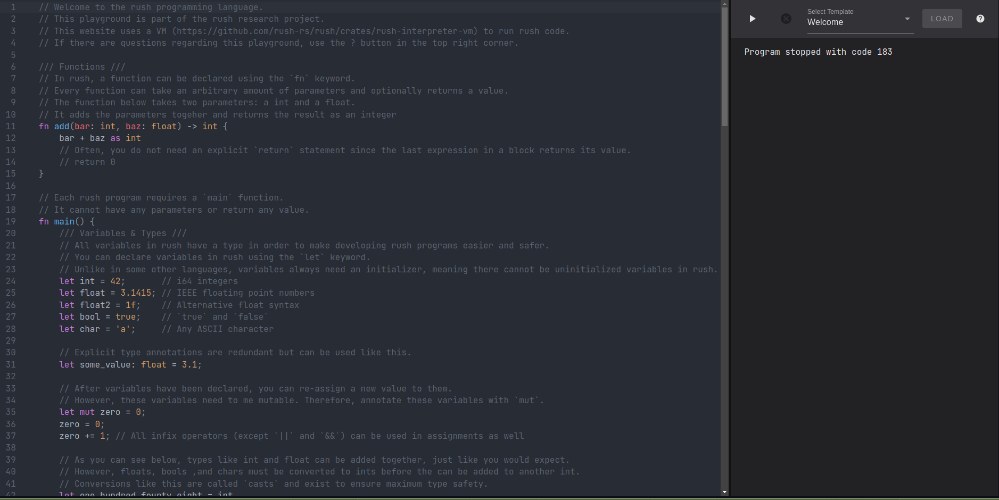

# rush Playground

A web-editor and runtime for showcasing and testing rush.

## What Is The Playground?

The rush playground enables everyone to use rush without the need for any sort
of installation. On the playground, users can develop their own
[rush](https://github.com/rush-rs/rush) programs.

The playground contains a web-editor which powered by
[Codemirror](https://github.com/codemirror).

Features of the web-editor include:

- Complete syntax highlighting
- Linting and diagnostics whilst typing

Furthermore, users can leverage the rush
[VM](https://github.com/rush-rs/rush/tree/main/crates/rush-interpreter-vm)
backend in order to run their programs.

Aside from the initial page load, the playground does not communicate with the
server. Therefore, linting and running rush only uses the
[`rush-analyzer`](https://github.com/rush-rs/rush/tree/main/crates/rush-analyzer)
and
[`rush-interpreter-vm`](https://github.com/rush-rs/rush/tree/main/crates/rush-interpreter-vm)
crates which are compiled to _WebAssembly_.

## Screenshot

